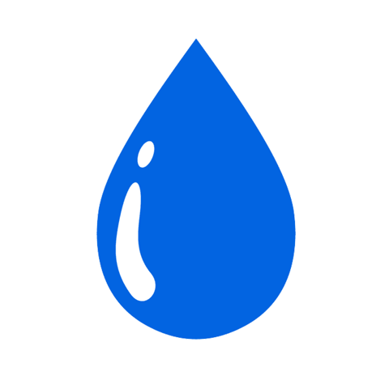
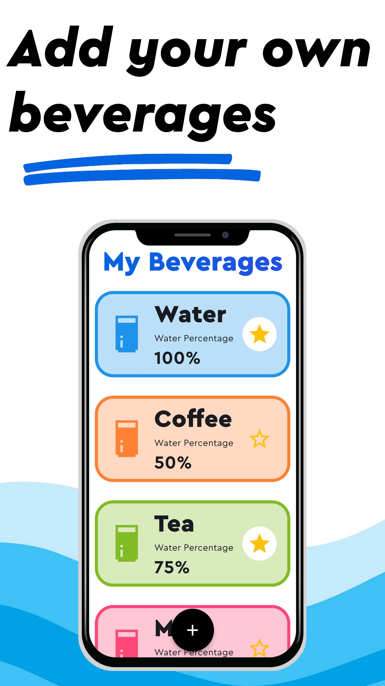
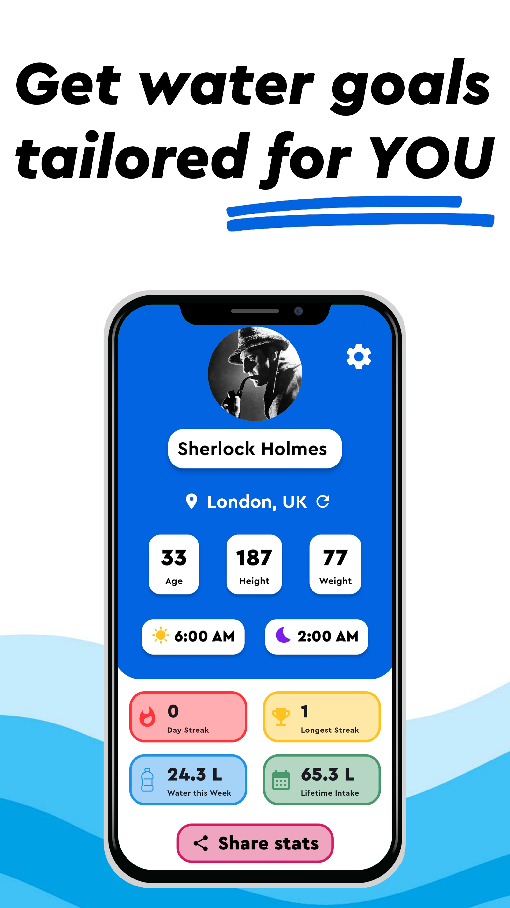
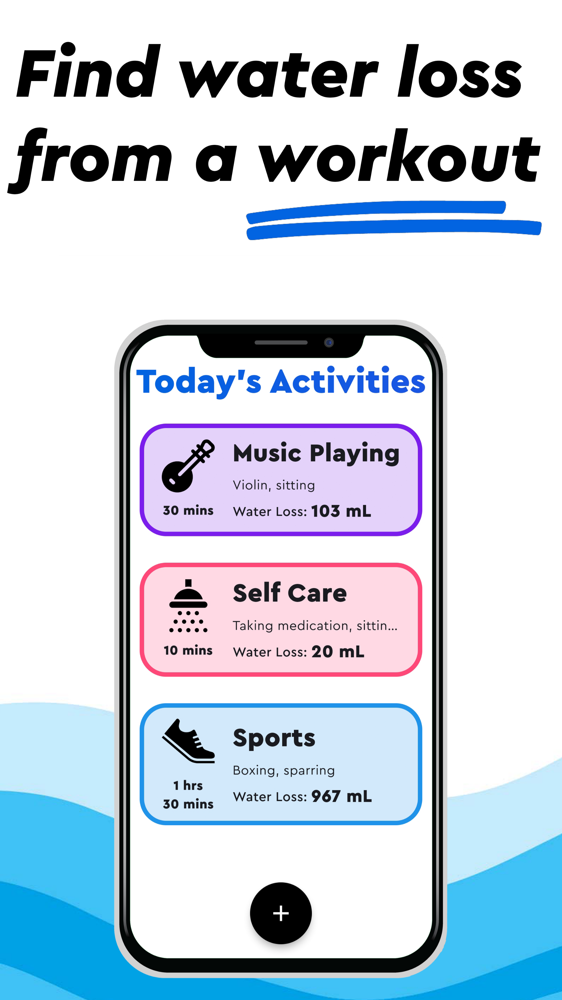
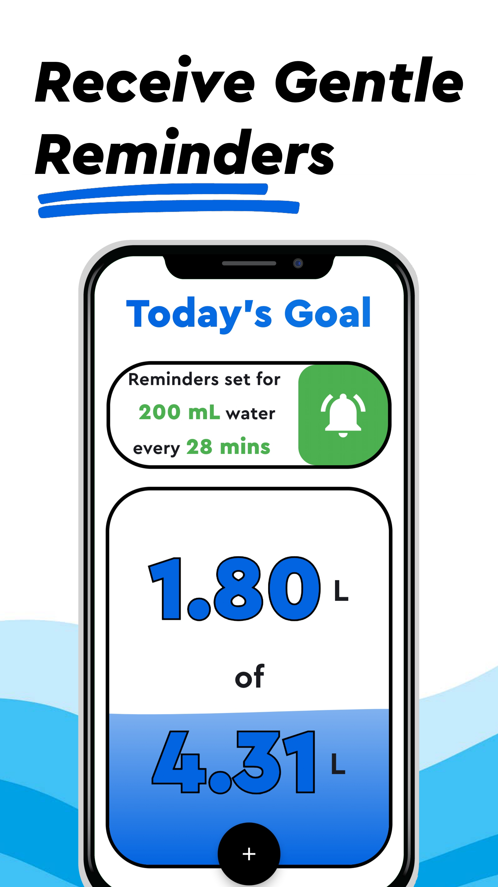
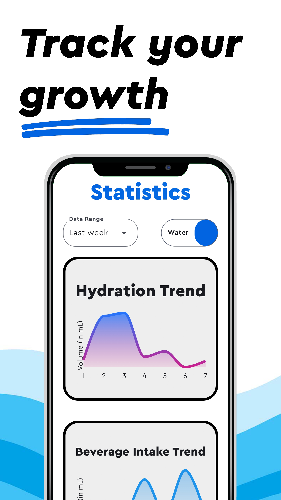

<h1 align="center"><b>Aqua</b></h1>

<div align="center">
  
</div>

<div align="center">
  <a href="https://play.google.com/store/apps/details?id=com.anshu79.aqua">
    
  </a>
  <a href="https://github.com/Anshu-79/aqua/releases/">
    
  </a>
</div>

---

Aqua is your ultimate hydration companion, designed to help you stay healthy and hydrated effortlessly. Built with Flutter, Aqua uses Drift for local database management.

## Release
Aqua is available on [Google Play](https://play.google.com/store/apps/details?id=com.anshu79.aqua) and [GitHub](https://github.com/Anshu-79/aqua/releases/).

## Key Features

### 🧃 Custom Beverages
Log a variety of beverages beyond water—juice, tea, coffee, and more. Easily create, add, and track your intake.

### 🧑 Personalized Hydration Goals
Aqua calculates your daily water intake by considering age, weight, gender, and weather conditions, ensuring goals tailored to your needs.

### ⛹️ Physical Activity Tracking
Log physical activities, and Aqua adjusts hydration goals based on water loss during those activities, keeping you optimally hydrated.

### 🔔 Friendly Reminders
Receive gentle reminders throughout the day to stay on track with your hydration goals, helping you develop healthy hydration habits.

### 💤 Sleep Schedule Integration
Aqua integrates with your sleep schedule, ensuring reminders are paused during sleep hours, so you can rest without interruptions.

### 🎨 User-Friendly Interface
Aqua features an intuitive, visually appealing interface that makes tracking water intake simple and effective.

### 📈 Progress Tracking
Track daily, weekly, and monthly hydration stats to monitor your progress and identify areas for improvement.

---
## App Screenshots

<div align="center">
    
    
    
    
    
</div>


## Developer Notes

### Android Release

- To build an app bundle Android, run `flutter build appbundle --release`

Note: Android SDK is required.

### API Keys
#### OpenWeatherAPI
- Obtain API key [here](https://home.openweathermap.org/users/sign_up).
- Store the key in `lib/api_keys.dart` as: `String openWeatherKey = <yourAPIkey>`.


### System Architecture
- **Front-end**: Files are stored in `lib/screens/`.
- **Navigation**: Post-onboarding screens are accessed using `lib/nav_bar.dart`.
- **Utilities**: Utilities like colors, fonts, and Firestore can be found in `lib/utils/`.
- **Database Queries**: Queries are stored in files named after respective tables in `lib/database/queries/`.
- **SharedPreferences**: User data like name, age, sex, etc., are stored here. The `onboard` boolean determines which widget (`OnboardingView()` or `NavBar()`) is displayed.
- **Weather Fetching**: Done once per day, with `last_run` stored in SharedPreferences to ensure the task is executed only once daily.
- **Notifications**: Managed by `NotificationsController`, which handles creation and deletion of notifications based on an `interval` (in minutes) and a `volume` (in mL).
- The `interval` is obtained using `calcReminderGap()`
- The `volume` is obtained using `calcMedianDrinkSize()`
- A single Drift `Database` object is instantiated in `lib/nav_bar.dart` and passed throughout the app to prevent race conditions caused by multiple database instantiation.

### Data Storage
Aqua uses `Drift` and `SharedPreferences` for local data storage.

#### Drift
The database includes:
1. `Beverages` - Stores all beverages.
2. `Drinks` - Logs all drinks, with a foreign key referencing `Beverages`.
3. `Activities` - Stores physical activities and their MET values.
4. `Workouts` - Logs activities performed by the user, with a foreign key referencing `Activities`.
5. `WaterGoals` - Stores daily water volumes like `consumed` and `total`.

### Default Values
- `calcReminderGap()` uses a minimum `reminderGap` value. If calculated gap is below this value, the function returns the predefined value. **DEFAULT**: `minReminderGap = 10`. 
- `calcMedianDrinkSize()` uses a positive integer range of last N drinks for median calculation. **DEFAULT**: `drinkRange = 20`.
- Both functions mentioned above can be found in `lib/database/queries/general_queries.dart` 
- Pre-defined beverages: `Water`, `Soda`, `Coffee`, `Tea`, and `Milk`. All are editable except `Water`.
- If user's location cannot be determined, the location on `Profile Screen` defaults to Mumbai, IN, due to its moderate climate and height from sea level.


### Reminder Algorithm
- `calcReminderGap()` determines reminder intervals. It considers sleep hours and adjusts the reminder time accordingly. For the full implementation, refer to `lib/database/queries/general_queries.dart`.

- *PSEUDOCODE* (written in Python for simplicity)
```
def calcReminderGap(consumed, total):
  
  if (sleepTime <= now <= wakeTime):
    return wakeTime - now
  
  timeLeft = sleepTime - now

  toDrink = total - consumed
  drinkSize = calcMedianDrinkSize()
  drinksNeeded = toDrink // drinkSize

  reminderGap = timeLeft // drinksNeeded

  if (reminderGap < 10):
    return 10
  
  return reminderGap
```

## Scientific Research
Aqua’s water intake calculations are based on research detailed in this [book](https://nap.nationalacademies.org/read/10925/chapter/6#74). 

The book provides a comprehensive water intake estimation model combining findings from multiple research studies.

The primary formula behind Aqua's water intake calculation is:
$DailyWaterGoal = AWI + RWL + [SWL]$, where, 
- **AWI** (Adequate Water Intake): Baseline intake based on age.
- **RWL** (Respiratory Water Loss): Dependent on weather and Metabolic Rate.
- **SWL** (Sweat Water Loss): Adjusted for physical activity.

A brief about the scientific terms used in the codebase are mentioned below:

### AWI (Adequate Water Intake)
- Data used for AWI is based on age and covers minimal water losses in temperate climates for sedentary individuals.
- Here, Beverage AWI (in liters) refers to the amount of water consumed in the form of liquid beverages including water itself.
- Total AWI (in liters) refers to the total amount of water drunk including Beverage AWI and water from foods.


|       |                  |               |                  |               |
| ----- | ---------------- | ------------- | ---------------- | ------------- |
| Age   | Beverage AWI (M) | Total AWI (M) | Beverage AWI (F) | Total AWI (F) |
| 1-3   | 0.9              | 1.3           | 0.9              | 1.3           |
| 4-8   | 1.2              | 1.7           | 1.2              | 1.7           |
| 9-13  | 1.8              | 2.4           | 1.6              | 2.1           |
| 14-18 | 2.6              | 3.3           | 1.8              | 2.3           |
| 19-30 | 3.0              | 3.7           | 2.2              | 2.7           |
| 31-50 | 3.0              | 3.7           | 2.2              | 2.7           |
| 51-70 | 3.0              | 3.7           | 2.2              | 2.7           |
| >70   | 3.0              | 3.7           | 2.2              | 2.7           |


### RWL (Respiratory Water Loss)
- The amount of respiratory water loss, via evaporation within the lungs, is dependent on both the ventilatory volume and water vapor pressure gradient.
- Generally, Physical Activity has a greater effect on respiratory water loss than environmental factors.
- Respiratory water loss (y ml/day) for temperate conditions can be predicted from Metabolic Rate (x kcal/day) using the equation $y= 0.107x + 92.2$
- High altitude exposure (4300 m above sea level, 448 mm Hg) can further increase respiratory loss by approximately 200 mL/day. This will give us the modified equation $y = 0.107x + 292.2$
- The respiratory water losses increase by approximately 340 mL/day when breathing –20°C versus +25°C air.

### SWL (Sweat Water Loss)

- For the average adult, loss of water by insensible diffusion is approximately 450 mL/day.
- When a gram of sweat water is evaporated, 2.43 kJ (0.58 kcal) of heat becomes kinetic energy (Latent Heat of Evaporation of Sweat Water). For a given hot weather condition, the required sweating rate for evaporative cooling is dependent upon the physical activity level (metabolic rate).
- To calculate the amount of water excreted in the form of sweat, we can use the formula $V = (1-i)\frac{E}{ΔH}$
 where,  
    V = volume of sweat excreted per minute (mL)  
    i = efficiency of metabolic activity  
    E = (MET) *  Body Weight * time (kJ)  
    ΔH = latent heat of evaporation (2.43 kJ at 30℃)
- The efficiency of humans while performing physical activity is usually 0.2 - 0.25, which means that 25% of the energy is used to do useful work whereas the other part of energy is used up elsewhere (most likely in raising the body's temperature which is what we need). 
- $SWL = 1.722 \cdot (1-i) MET \cdot w \cdot t $


### BMR (Basal Metabolic Rate)
- Basal metabolic rate is the rate of energy expenditure per unit time by endothermic animals at rest. It is reported in energy units per unit time ranging from watt to ml O₂/min or joule per hour per kg body mass. Proper measurement requires a strict set of criteria to be met.
- We used the Mifflin St Jeor equation to measure basal metabolic rate. It is given as such: $P = (10m + 6.25h - 5a + s)$, where,

    P = total heat production at complete rest (kcal/day)

    m = mass (kg)

    h = height (cm)

    a = age (years)

    s = +5 for males, -161 for females.

### MET (Metabolic Equivalent of Task)
- The **metabolic equivalent of task (MET)** is the objective measure of the ratio of the rate at which a person expends energy, relative to the mass of that person. For more info, check [Wikipedia](https://en.wikipedia.org/wiki/Basal_metabolic_rate).
- Aqua uses the MET values of 800+ activities mentioned on the _Compendium of Physical Activities_ site [here](https://pacompendium.com/adult-compendium/).
